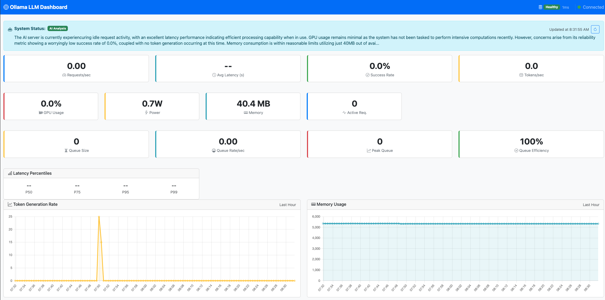

# Llama Metrics - Ollama Monitoring with Prometheus

A comprehensive monitoring solution for Ollama AI models using Prometheus metrics collection and traffic generation for performance testing.

## 🎯 Overview

This project provides a complete monitoring stack for Ollama AI models, including:

- **Traffic Generator**: Sends diverse questions to Ollama models for load testing
- **Metrics Server**: Exposes Prometheus metrics for monitoring AI model performance
- **Question Database**: 1000+ curated questions across 10 categories
- **Prometheus Integration**: Ready-to-use Prometheus configuration

## 🏗️ Architecture

```
[Traffic Generator] → [Ollama API] → [Metrics Server] → [Prometheus] → [Dashboard]
        ↓                ↓              ↓              ↓           ↓
   1000 Questions    AI Responses    Metrics Collection  Scraping   Visualization
```

## 📊 Dashboard

The real-time dashboard provides comprehensive monitoring of your Ollama LLM performance:



### Dashboard Features:
- **Real-time Metrics**: Request rate, success rate, and token generation speed
- **System Monitoring**: GPU usage, power consumption, and memory utilization
- **Queue Analytics**: Request queue size, processing rate, and efficiency
- **Latency Tracking**: P50, P75, P95, and P99 percentiles
- **Time Series Graphs**: Historical view of token generation and memory usage
- **AI Status**: Automatic health analysis with actionable insights

## 📁 Project Structure

```
├── traffic_generator.py          # Main traffic generator
├── simple_metrics_server.py      # Lightweight metrics server
├── app.py                        # LlamaIndex-based app (advanced)
├── run_prometheus.sh             # Prometheus setup script
├── config/                       # Configuration files
│   ├── prometheus/
│   │   └── prometheus.yml        # Prometheus configuration
│   ├── services/                 # Service-specific configs
│   └── alerts/                   # Alert rules
├── questions/                    # Question categories (10 files)
│   ├── general_knowledge.json
│   ├── science.json
│   ├── technology.json
│   ├── history.json
│   ├── geography.json
│   ├── sports.json
│   ├── entertainment.json
│   ├── literature.json
│   ├── philosophy.json
│   └── food.json
├── requirements_traffic.txt      # Minimal dependencies
├── requirements_app.txt          # Full LlamaIndex dependencies
└── README_traffic_generator.md   # Detailed traffic generator docs
```

## 🚀 Quick Start

### Prerequisites

- **Ollama** installed and running
- **Python 3.8+**
- **Podman** or **Docker** (for Prometheus)

### 1. Install Dependencies

```bash
# For traffic generator only (lightweight)
pip install -r requirements_traffic.txt

# OR for full LlamaIndex features
pip install -r requirements_app.txt
```

### 2. Start Ollama

```bash
ollama serve
ollama pull phi3:mini  # or your preferred model
```

### 3. Start Metrics Server

```bash
# Simple metrics server (recommended)
python simple_metrics_server.py

# OR LlamaIndex-based server (advanced)
python app.py
```

### 4. Start Prometheus

```bash
./run_prometheus.sh
```

### 5. Generate Traffic

```bash
# Basic usage
python traffic_generator.py

# With options
python traffic_generator.py --max 50 --delay 2
```

### 6. View Monitoring

- **Prometheus Dashboard**: http://localhost:9090
- **Raw Metrics**: http://localhost:8000/metrics

## 🎯 Traffic Generator

### Features

- **1000+ Questions** across 10 diverse categories
- **Random Selection** for varied testing
- **Serialized Processing** (waits for each response)
- **Configurable Parameters** (model, delay, limits)
- **Real-time Statistics** and logging

### Usage Examples

```bash
# Default usage (unlimited questions, 1s delay)
python traffic_generator.py

# Limited test run
python traffic_generator.py --max 10 --delay 3

# Fast load testing
python traffic_generator.py --delay 0.5

# Different model
python traffic_generator.py --model llama2
```

### Question Categories

- **General Knowledge** (100) - Basic facts and trivia
- **Science** (100) - Physics, chemistry, biology
- **Technology** (100) - Computing, software, modern tech
- **History** (100) - World events, civilizations
- **Geography** (100) - Countries, capitals, physical features
- **Sports** (100) - Various sports, rules, athletes
- **Entertainment** (100) - Movies, music, TV, celebrities
- **Literature** (100) - Books, authors, characters
- **Philosophy** (100) - Concepts, thinkers, theories
- **Food** (100) - Cuisine, cooking, ingredients

## 📊 Metrics Collected

### Ollama Metrics

- `ollama_requests_total{model, status}` - Total requests by model and status
- `ollama_request_duration_seconds{model}` - Request latency histogram
- `ollama_active_requests{model}` - Current active requests
- `ollama_model_info` - Available model information

### Traffic Metrics

- `traffic_questions_asked_total{category}` - Questions by category
- Standard Python metrics (GC, memory, etc.)

## 🛠️ Configuration

### Prometheus Configuration

The included `config/prometheus/prometheus.yml` is configured to scrape:

- **Target**: `host.containers.internal:8000`
- **Interval**: 15 seconds
- **Job**: `llamastack_app`

### Traffic Generator Options

- `--model`: Ollama model to use (default: `phi3:mini`)
- `--url`: Ollama API URL (default: `http://localhost:11434`)
- `--max`: Maximum questions to ask (default: unlimited)
- `--delay`: Delay between requests in seconds (default: 1.0)

## 🔧 Advanced Usage

### Custom Question Categories

Add new question files to the `questions/` directory:

```json
{
  "$schema": "http://json-schema.org/draft-07/schema#",
  "category": "Your Category",
  "questions": [
    "Your question 1?",
    "Your question 2?",
    ...
  ]
}
```

### Prometheus Queries

Example queries for the Prometheus dashboard:

```promql
# Request rate
rate(ollama_requests_total[5m])

# Average latency
rate(ollama_request_duration_seconds_sum[5m]) / rate(ollama_request_duration_seconds_count[5m])

# Questions by category
rate(traffic_questions_asked_total[5m])

# Error rate
rate(ollama_requests_total{status="error"}[5m])
```

## ⚡ Performance Tuning

### Preventing Ollama Overload

To avoid resource contention and multiple model runner processes:

```bash
# Set before starting Ollama
export OLLAMA_NUM_PARALLEL=2      # Limit parallel model instances
export OLLAMA_MAX_LOADED_MODELS=2 # Limit loaded models

# Or use the Makefile targets which include these settings
make start-ollama
```

### Proxy Configuration

The monitoring proxy includes a request queue to handle load spikes:

```bash
# Default settings (applied automatically with make start-proxy)
--max-concurrency 4    # Worker threads (matches Ollama capacity)
--max-queue-size 100   # Request buffer size

# Custom settings
export MAX_CONCURRENCY=6
export MAX_QUEUE_SIZE=200
make start-proxy
```

### Quick Start with Optimized Settings

```bash
make setup          # Install dependencies
make start          # Starts all services with optimized settings
```

## 🐛 Troubleshooting

### Traffic Generator Issues

- **"Cannot connect to Ollama"**: Ensure Ollama is running (`ollama serve`)
- **"Model not found"**: Check available models (`ollama list`)
- **High error rates**: Reduce request frequency with `--delay`

### Metrics Server Issues

- **Port 8000 in use**: Stop existing processes or change port
- **Import errors**: Install dependencies (`pip install -r requirements_traffic.txt`)

### Prometheus Issues

- **Target down**: Ensure metrics server is running on port 8000
- **Container conflicts**: Stop existing containers (`podman stop prometheus`)

## 📝 Development

### Adding New Metrics

Edit `simple_metrics_server.py` to add custom metrics:

```python
NEW_METRIC = Counter('new_metric_total', 'Description')
NEW_METRIC.inc()  # Increment the metric
```

### Extending Question Categories

1. Create new JSON file in `questions/` directory
2. Follow the existing schema format
3. Traffic generator will automatically load it

## 🤝 Contributing

1. Fork the repository
2. Create a feature branch
3. Add your improvements
4. Submit a pull request

## 📄 License

This project is open source. Feel free to use and modify as needed.

## 🔗 Related Projects

- [Ollama](https://ollama.ai/) - Local AI model runner
- [Prometheus](https://prometheus.io/) - Monitoring system
- [LlamaIndex](https://www.llamaindex.ai/) - Data framework for AI apps

---

**Happy Monitoring!** 🚀📊